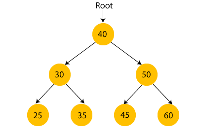

二叉树（binary tree）是指树中节点的**度不大于2**的有序树，它是一种最简单且最重要的树。 二叉树的递归定义为：二叉树是一棵空树，或者是一棵由一个根节点和两棵互不相交的，分别称作根的左子树和右子树组成的非空树；左子树和右子树又同样都是二叉树 。本文总结了BST、红黑树、2-3树等常用的二叉树结构。



<!--more-->

## 二叉树

### 二叉查找树

二叉查找树（英语：Binary Search Tree），也称为二叉查找树、有序二叉树（ordered binary tree）或排序二叉树（sorted binary tree），是指一棵空树或者具有下列性质的二叉树：

1. 若任意节点的左子树不空，则左子树上所有节点的值均小于它的根节点的值；
2. 若任意节点的右子树不空，则右子树上所有节点的值均大于它的根节点的值；
3. 任意节点的左、右子树也分别为二叉查找树；

二叉查找树相比于其他数据结构的优势在于查找、插入的时间复杂度较低Olog(N)。二叉查找树是基础性数据结构，用于构建更为抽象的数据结构，如集合、多重集、关联数组等。

### 平衡二叉树AVL

### B+树

### 红黑树

### 字典树

## 算法模板

拿到二叉树相关的题目，首先要看是否是二叉搜索树，对于二叉搜索树通过inorder遍历（深度优先）转换为升序数组的遍历。

### 二叉搜索树的众数[leetcode 501]

https://leetcode-cn.com/problems/find-mode-in-binary-search-tree/

```go
func findMode(root *TreeNode) (answer []int) {
   var dfs func(*TreeNode)
   var maxCount, base, count int
   // 对inorder有序遍历进行处理
   update := func(value int) {
      if base == value {
         count++
      } else {
         // 此处count为何是1？
         base, count = value, 1
      }
      if count == maxCount {
         answer = append(answer, base)
      } else if count > maxCount {
         // 此处base是符合条件的answer
         answer = []int{base}
         maxCount = count
      }
   }
   // inorder遍历把BST转变为有序数组的遍历
   dfs = func(node *TreeNode) {
      if node == nil {
         return
      }
      if node.Left != nil {
         dfs(node.Left)
      }
      update(node.Val)
      if node.Right != nil {
         dfs(node.Right)
      }
   }
   dfs(root)
   return
}
```

### 最近的公共祖先[leetcode 235]

根据BST的性质，如果p/q的值都大于root，则最近公共祖先在root右侧，反之在左侧。以此递归。

https://leetcode-cn.com/problems/lowest-common-ancestor-of-a-binary-search-tree/

```go
func lowestCommonAncestor(root, p, q *TreeNode) *TreeNode {
   if root.Val > p.Val && root.Val > q.Val {
      return lowestCommonAncestor(root.Left, p, q)
   } else if root.Val < p.Val && root.Val < q.Val {
      return lowestCommonAncestor(root.Right, p, q)
   } else {
      return root
   }
}
```

### 有序数组转二叉树

https://leetcode-cn.com/problems/minimum-height-tree-lcci/

```go
func sortedArrayToBST(nums []int) *TreeNode {
   var helper func(nums []int, left int, right int) *TreeNode
   helper = func(nums []int, left int, right int) *TreeNode {
      if left > right {
         return nil
      }
      mid := left + ((right - left) / 2)
      node := &TreeNode{Val: nums[mid]}
      node.Left = helper(nums, left, mid-1)
      node.Right = helper(nums, mid+1, right)
      return node
   }
   return helper(nums, 0, len(nums)-1)
}
```

### 恢复二叉树

找到第一个递减的后值，和第二个递减的前值；然后交换他们的位置。

https://leetcode-cn.com/problems/recover-binary-search-tree/

```go
func recoverTree(root *TreeNode) {
   // 中序遍历的实现有迭代和递归两种等价的写法，在本方法中提供迭代实现的写法。使用迭代实现中序遍历需要手动维护栈。
   stack := []*TreeNode{}
   var x, y, pred *TreeNode
   for len(stack) > 0 || root != nil {
      for root != nil {
         stack = append(stack, root)
         root = root.Left
      }
      root = stack[len(stack)-1]
      stack = stack[:len(stack)-1]
      if pred != nil && root.Val < pred.Val {
         y = root
         if x == nil {
            x = pred
         } else {
            break
         }
      }
      pred = root
      root = root.Right
   }
   x.Val, y.Val = y.Val, x.Val
}
```