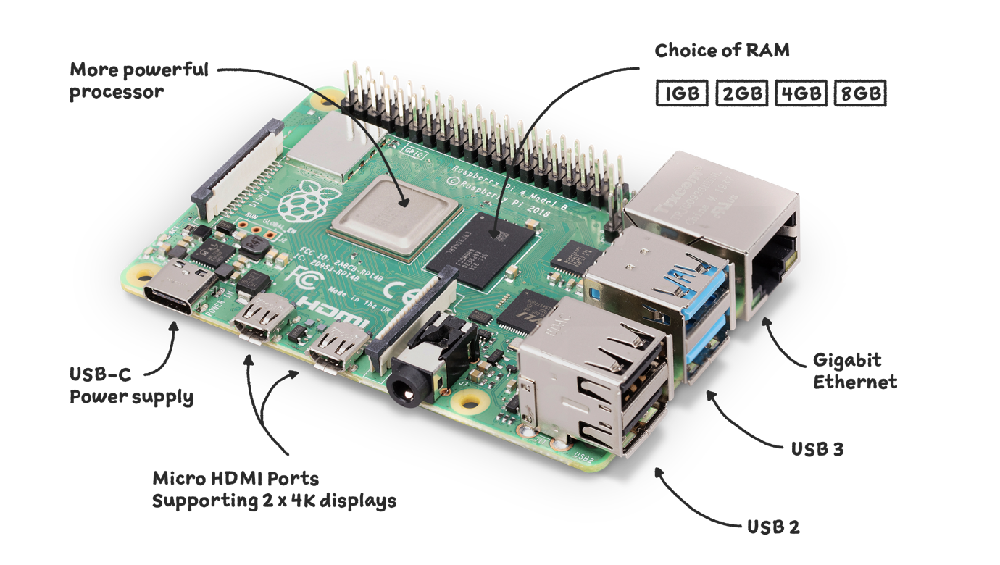
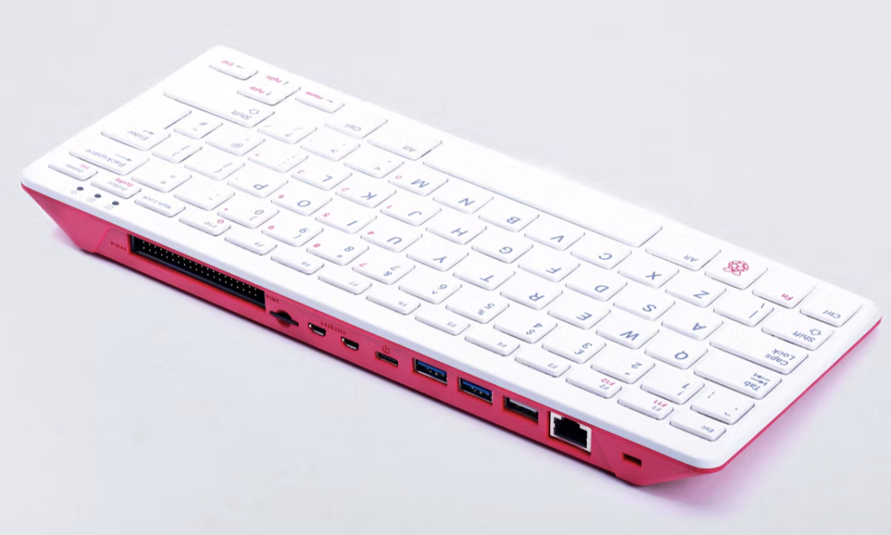
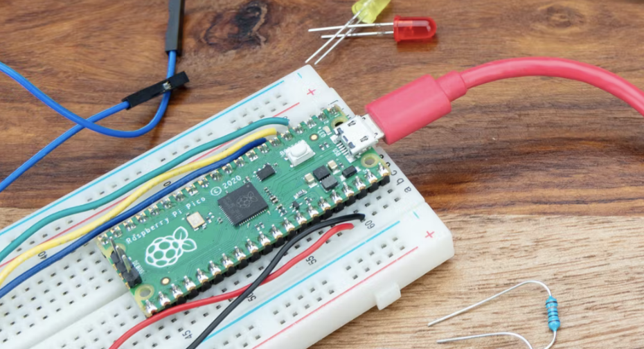
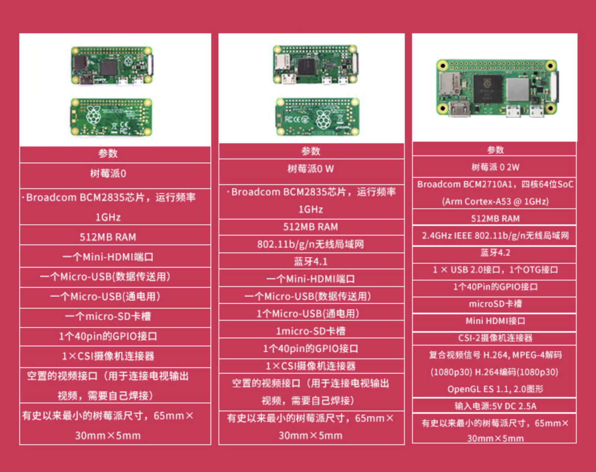
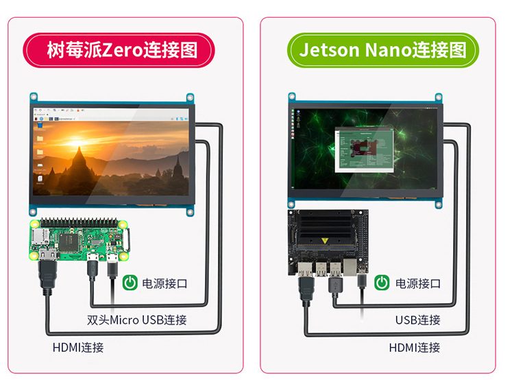
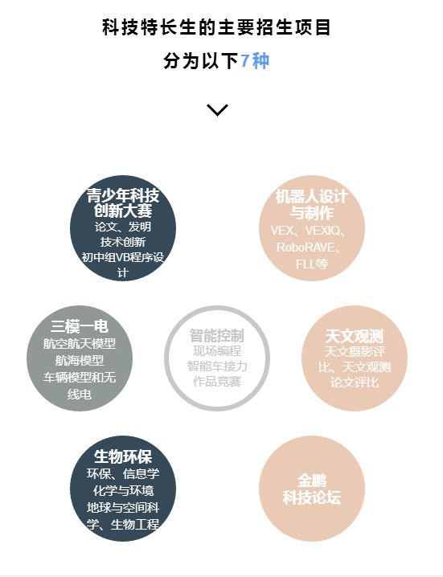

针对各类型开发版

## 单板计算机

### 树莓派

#### 型号对比

[DataSheet](https://datasheets.raspberrypi.com/)

|                       型号                        |                              3B                              |                             3B+                              |                             3A+                              |                              4B                              |                             400                              |
| :-----------------------------------------------: | :----------------------------------------------------------: | :----------------------------------------------------------: | :----------------------------------------------------------: | :----------------------------------------------------------: | :----------------------------------------------------------: |
|                     上市价格                      |                             $35                              |                             $35                              |                             $35                              |                         $35/45/55/75                         |                             $70                              |
|  [SoC](https://zh.wikipedia.org/wiki/系统单晶片)  | [Broadcom](https://zh.wikipedia.org/wiki/Broadcom) BCM2837（[CPU](https://zh.wikipedia.org/wiki/CPU)，GPU DSP和[SDRAM](https://zh.wikipedia.org/wiki/SDRAM)、[USB](https://zh.wikipedia.org/wiki/USB)） | [Broadcom](https://zh.wikipedia.org/wiki/Broadcom) BCM2837（[CPU](https://zh.wikipedia.org/wiki/CPU)，GPU DSP和[SDRAM](https://zh.wikipedia.org/wiki/SDRAM)、[USB](https://zh.wikipedia.org/wiki/USB)） | [Broadcom](https://zh.wikipedia.org/wiki/Broadcom) BCM2837（[CPU](https://zh.wikipedia.org/wiki/CPU)，GPU DSP和[SDRAM](https://zh.wikipedia.org/wiki/SDRAM)、[USB](https://zh.wikipedia.org/wiki/USB)） |                       Broadcom BCM2711                       |                       Broadcom BCM2711                       |
|     [CPU](https://zh.wikipedia.org/wiki/CPU)      | [ARM Cortex-A53](https://zh.wikipedia.org/w/index.php?title=ARM_Cortex-53&action=edit&redlink=1) 64位 (ARMv8系列) 1.2GHz (四核心) | [ARM Cortex-A53](https://zh.wikipedia.org/w/index.php?title=ARM_Cortex-53&action=edit&redlink=1) 64位 (ARMv8系列) 1.4GHz (四核心) | [ARM Cortex-A53](https://zh.wikipedia.org/w/index.php?title=ARM_Cortex-53&action=edit&redlink=1) 64位 (ARMv8系列) 1.4GHz (四核心) | [ARM Cortex-A72](https://zh.wikipedia.org/w/index.php?title=ARM_Cortex-A72&action=edit&redlink=1) (ARMv8系列) 1.5GHz (四核心) | [ARM Cortex-A72](https://zh.wikipedia.org/w/index.php?title=ARM_Cortex-A72&action=edit&redlink=1) (ARMv8系列) 1.8GHz (四核心) |
|     [GPU](https://zh.wikipedia.org/wiki/GPU)      | [Broadcom](https://zh.wikipedia.org/wiki/Broadcom) VideoCore IV[[27\]](https://zh.wikipedia.org/wiki/树莓派#cite_note-hq-qa-27), [OpenGL ES](https://zh.wikipedia.org/wiki/OpenGL_ES) 2.0, [1080p](https://zh.wikipedia.org/wiki/1080p) 30 [h.264](https://zh.wikipedia.org/wiki/H.264)/[MPEG-4](https://zh.wikipedia.org/wiki/MPEG-4) [AVC](https://zh.wikipedia.org/wiki/AVC)高清解码器 | [Broadcom](https://zh.wikipedia.org/wiki/Broadcom) VideoCore IV[[27\]](https://zh.wikipedia.org/wiki/树莓派#cite_note-hq-qa-27), [OpenGL ES](https://zh.wikipedia.org/wiki/OpenGL_ES) 2.0, [1080p](https://zh.wikipedia.org/wiki/1080p) 30 [h.264](https://zh.wikipedia.org/wiki/H.264)/[MPEG-4](https://zh.wikipedia.org/wiki/MPEG-4) [AVC](https://zh.wikipedia.org/wiki/AVC)高清解码器 | [Broadcom](https://zh.wikipedia.org/wiki/Broadcom) VideoCore IV[[27\]](https://zh.wikipedia.org/wiki/树莓派#cite_note-hq-qa-27), [OpenGL ES](https://zh.wikipedia.org/wiki/OpenGL_ES) 2.0, [1080p](https://zh.wikipedia.org/wiki/1080p) 30 [h.264](https://zh.wikipedia.org/wiki/H.264)/[MPEG-4](https://zh.wikipedia.org/wiki/MPEG-4) [AVC](https://zh.wikipedia.org/wiki/AVC)高清解码器 | [H.265](https://zh.wikipedia.org/wiki/H.265) (4Kp60), [H.264](https://zh.wikipedia.org/wiki/H.264) (1080p60 / 1080p30)，OpenGL ES 3.0 | [H.265](https://zh.wikipedia.org/wiki/H.265) (4Kp60), [H.264](https://zh.wikipedia.org/wiki/H.264) (1080p60 / 1080p30)，OpenGL ES 3.0 |
|    [内存](https://zh.wikipedia.org/wiki/内存)     |    1 GB ([LPDDR2](https://zh.wikipedia.org/wiki/LPDDR2))     |    1 GB ([LPDDR2](https://zh.wikipedia.org/wiki/LPDDR2))     |    512MB ([LPDDR2](https://zh.wikipedia.org/wiki/LPDDR2))    | 2/4/8 GB ([LPDDR4](https://zh.wikipedia.org/wiki/LPDDR4)-3200) |  4GB ([LPDDR4](https://zh.wikipedia.org/wiki/LPDDR4)-3200）  |
| [USB](https://zh.wikipedia.org/wiki/USB) 接口个数 |   [USB 2.0](https://zh.wikipedia.org/wiki/USB_2.0)（4个）    |   [USB 2.0](https://zh.wikipedia.org/wiki/USB_2.0)（4个）    |   [USB 2.0](https://zh.wikipedia.org/wiki/USB_2.0)（1个）    | [USB 2.0](https://zh.wikipedia.org/wiki/USB_2.0)（2个），[USB 3.0](https://zh.wikipedia.org/wiki/USB_3.0)（2个） | [USB 2.0](https://zh.wikipedia.org/wiki/USB_2.0)（1个），[USB 3.0](https://zh.wikipedia.org/wiki/USB_3.0)（2个） |
|                     音源输出                      | 3.5mm插孔，[HDMI](https://zh.wikipedia.org/wiki/HDMI)电子输出或[I²S](https://zh.wikipedia.org/wiki/I²S) | 3.5mm插孔，[HDMI](https://zh.wikipedia.org/wiki/HDMI)电子输出或[I²S](https://zh.wikipedia.org/wiki/I²S) | 3.5mm插孔，[HDMI](https://zh.wikipedia.org/wiki/HDMI)电子输出或[I²S](https://zh.wikipedia.org/wiki/I²S) | 3.5mm插孔，[HDMI](https://zh.wikipedia.org/wiki/HDMI)电子输出或[I²S](https://zh.wikipedia.org/wiki/I²S) |      [HDMI](https://zh.wikipedia.org/wiki/HDMI)电子输出      |
|                     板载存储                      |    [MicroSD](https://zh.wikipedia.org/wiki/MicroSD)卡插槽    |    [MicroSD](https://zh.wikipedia.org/wiki/MicroSD)卡插槽    |    [MicroSD](https://zh.wikipedia.org/wiki/MicroSD)卡插槽    |    [MicroSD](https://zh.wikipedia.org/wiki/MicroSD)卡插槽    |    [MicroSD](https://zh.wikipedia.org/wiki/MicroSD)卡插槽    |
|                     网络接口                      | 10/100Mbps [以太网](https://zh.wikipedia.org/wiki/以太网)接口（[RJ45](https://zh.wikipedia.org/wiki/RJ45)接口），支持[802.11n](https://zh.wikipedia.org/wiki/802.11n)无线网络及[蓝牙](https://zh.wikipedia.org/wiki/蓝牙)4.1 | 100/1000Mbps [以太网](https://zh.wikipedia.org/wiki/以太网)接口（[RJ45](https://zh.wikipedia.org/wiki/RJ45)接口），支持[802.11n](https://zh.wikipedia.org/wiki/802.11n)无线网络及[蓝牙](https://zh.wikipedia.org/wiki/蓝牙)4.1 | 100/1000Mbps [以太网](https://zh.wikipedia.org/wiki/以太网)接口（[RJ45](https://zh.wikipedia.org/wiki/RJ45)接口），支持[802.11n](https://zh.wikipedia.org/wiki/802.11n)无线网络及[蓝牙](https://zh.wikipedia.org/wiki/蓝牙)4.1 | 千兆以太网，支持双频[802.11ac](https://zh.wikipedia.org/wiki/802.11n)的无线网络及[蓝牙](https://zh.wikipedia.org/wiki/蓝牙)5.0 | 千兆以太网，支持双频[802.11ac](https://zh.wikipedia.org/wiki/802.11n)的无线网络及[蓝牙](https://zh.wikipedia.org/wiki/蓝牙)5.0 |
|                    GPIO引脚数                     |                              40                              |                              40                              |                              40                              |                              40                              |                              40                              |
|                     额定功率                      |                      10.5 瓦 (5V/2.1A)                       |                      10.5 瓦 (5V/2.1A)                       |                      10.5 瓦 (5V/2.1A)                       |                        15 瓦 (5V/3A)                         |                        15 瓦 (5V/3A)                         |
|                     电源输入                      |              5V 电压 (通过MicroUSB或经GPIO输入)              |              5V 电压 (通过MicroUSB或经GPIO输入)              |              5V 电压 (通过MicroUSB或经GPIO输入)              |               5V 电压 (通过USB-C或经GPIO输入)                |               5V 电压 (通过USB-C或经GPIO输入)                |
|                       型号                        |                              3B                              |                             3B+                              |                             3A+                              |                              4B                              |                             400                              |

#### 辅助配件

##### 树莓派集群箱

https://www.amazon.cn/dp/B09S11Q684/ref=sr_1_10?__mk_zh_CN=%E4%BA%9A%E9%A9%AC%E9%80%8A%E7%BD%91%E7%AB%99&crid=U8PVF1SDZD3J&keywords=UCTRONICS&qid=1649509256&sprefix=uctronics%2Caps%2C207&sr=8-10

https://www.amazon.cn/dp/B09K439BTY/ref=sr_1_6?__mk_zh_CN=%E4%BA%9A%E9%A9%AC%E9%80%8A%E7%BD%91%E7%AB%99&crid=1TR5BXHZ3HN62&keywords=%E6%A0%91%E8%8E%93%E6%B4%BE&qid=1649509542&sprefix=%E6%A0%91%E8%8E%93%E6%B4%BE%2Caps%2C239&sr=8-6

#### Raspberry Pi 3 B+

#### Raspberry Pi 4 

#### Pi Compute Module 4(CM4)

[规格说明书](https://datasheets.raspberrypi.com/cm4/cm4-product-brief.pdf)

#### CM4IO

#### Raspberry Pi 400

[规格说明书](https://datasheets.raspberrypi.com/rpi400/raspberry-pi-400-product-brief.pdf)

#### Pi Pico

[规格说明书](https://datasheets.raspberrypi.com/pico/Pico-R3-A4-Pinout.pdf)

https://item.taobao.com/item.htm?spm=2013.1.w4023-23859380088.8.5cbd7e21ySJBki&id=637378283845

Raspberry Pi Pico is a tiny, fast, and versatile board built using RP2040, a brand new microcontroller chip designed by Raspberry Pi in the UK.

#### Pi Zero

#### Pi Zero W

#### Pi Zero 2 W 

$15

#### Pi Zero WH

### Jetson 

#### Jetson Nano

### BBC Micro:Bit 

### Arduino

## 显示器

#### 7寸显示器

https://detail.1688.com/offer/645885602753.html

#### 10.1寸触摸屏

https://detail.1688.com/offer/658297236203.html

## 电池

### 18650锂电池

18650是锂离子电池的鼻祖--[日本](https://baike.baidu.com/item/日本/111617)SONY公司当年为了节省成本而定下的一种标准性的[锂离子](https://baike.baidu.com/item/锂离子/7036470)电池型号，其中18表示直径为18mm，65表示长度为65mm，0表示为圆柱形电池。

3.7v、3.2v

常见容量 2000mAh/2600mAh/3000mAh

## 教程

### 操作系统

#### 树莓派4运行Windows 11

https://news.mydrivers.com/1/767/767280.htm

[操作系统下载](https://next.itellyou.cn/Original/#cbp=Product?ID=42e87ac8-9cd6-eb11-bdf8-e0d4e850c9c6)

#### 树莓派4B通过U盘启动

https://www.quarkbook.com/?p=638

### 开发套件

#### MicroPython

https://github.com/micropython/micropython/wiki

https://www.raspberrypi.com/documentation/microcontrollers/micropython.html

#### PicoPython

https://datasheets.raspberrypi.com/pico/raspberry-pi-pico-python-sdk.pdf

### 存储

#### eMMC Flash

EMMC = NAND + 控制器 + 标准封装接口

功能包括存储以及取代NOR Flash的开机功能，不需要处理NAND Flash相容性和管理问题。手机厂商不需要因为NAND Flash供应商或者不同制程世代而重新设计规格。

eMMC (Embedded Multi Media Card）是MMC协会订立、主要针对手机或平板电脑等产品的内嵌式存储器标准规格。eMMC在封装中集成了一个控制器，提供标准接口并管理闪存，使得手机厂商就能专注于产品开发的其它部分，并缩短向市场推出产品的时间。

#### 闪存 Flash Memory

闪存，是一种电子式可清除程序化只读存储器的形式，允许在操作中被多次擦或写的存储器。这种科技主要用于一般性资料存储，以及在电脑与其他数字产品间交换传输资料，如储存卡与U盘。闪存是一种特殊的、以宏块抹写的EEPROM。早期的闪存进行一次抹除，就会清除掉整颗芯片上的资料。

#### NAND Flash

1989年，东芝公司发表了NAND Flash结构，强调降低每比特的成本，更高的性能，并且像磁盘一样可以通过接口轻松升级。

NAND结构能提供极高的单元密度，可以达到高存储密度，并且写入和擦除的速度也很快（NAND的基本存储单元是页），应用NAND的困难在于flash的管理需要特殊的系统接口。

NAND一般以存储数据为主，晶片容量大，容量可以达到2Gb甚至更大，NAND的读取是以一次读取一块的形式来进行的，通常一次读取512个字节，采用这种技术的Flash比较廉价；。用户不能直接运行NAND上的代码，因此很多使用NAND的开发板除了使用NAND Flash以外，还加上一块小的NOR Flash来运行启动代码。

#### NOR Flash

NOR Flash是Intel在1988年创建的。NOR采用内存的随机读取技术，允许随机寻址，不需要纠错以及较高的每比特成本。如果我们只是利用闪存来存储小量代码，那无疑NOR是非常合适的。NOR 的传输效率（注意是效率，并不是速度）很高，在1~4MB的小容量时具有很高的成本效益，但是很低的写入和擦除速度大大影响到它的性能（因为NOR和内存一样基本存储单元是字节）。NOR的一大特点是应用程序可以直接在Flash闪存内运行，不必再把代码读到系统RAM中。

#### UFS

UFS最新标准是UFS3.0，它最大带宽可以达到2163MB/s。目前，大多数5G手机的机型都用上了UFS 3.0储存方案。但也有旗舰手机机型仍采用UFS 2.1，这其中的原因也很简单：就目前而言，UFS 3.0虽然在传输速率以及实际体验上“秒杀”UFS 2.1，但UFS 3.0也面临着诸多问题：暂时还未实现更大规模的普及、产能不足、价格昂贵。

## 学习社区

### 硬件学习

#### https://community.element14.com/

#### https://www.hackster.io/

*Hackster* is a community dedicated to learning hardware, from beginner to pro. Share your projects and learn from other developers.

## 供应商

### 电子元件

####e络盟

https://cn.element14.com/

e络盟为[易络](https://baike.baidu.com/item/易络)盟电子（中国）有限公司的商标名称，前身为派睿电子（上海）有限公司，隶属于英国Premier Farnell集团。e络盟取自其英文商标名称element14的谐音，来自化学[元素周期表](https://baike.baidu.com/item/元素周期表/282048)上硅的化学名称，注入了电子行业的DNA，它深刻理解[电子设计工程师](https://baike.baidu.com/item/电子设计工程师/4051545)的需求，并因此而诞生。

P4 4GB 388元

https://cn.element14.com/raspberry-pi/rpi4-modbp-4gb/raspberry-pi-4-model-b-4gb/dp/3051887

#### 贸泽电子

https://www.mouser.cn/

#### 搜索引擎OCTOPART

https://octopart.com/

#### 唯样

https://www.oneyac.com/

#### 杭州隽鹏电子

https://qpdz.taobao.com/?spm=2013.1.1000126.3.56d163a9adv9tq

### 外壳

铝合金外壳 http://www.lvwaikechang.com/

## 科技特长生

