二分法是一种普通又重要的算法思想，二分搜索又称折半搜索，区别于线性查找O(n)的时间复杂度，二分法的时间复杂度降到了O(logN)。但二分法的使用也是有条件的，它要求原始序列具有`单调性`。本文会详细介绍二分法的前提、推论以及例题，力求深入浅出。

<!--more-->

## 二分查找

### 分治思想与二分法

分治算法的主要思想是将原问题分成若干个子问题，解决这些子问题再最终合并出原问题的答案。在计算过程中，子问题会被递归地分解成更小的子问题，直到子问题满足边界条件。最后，算法会层层递回原问题的答案。

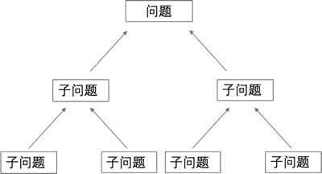

二分算法是比较一次，直接扔掉不符合要求的那一半。（如果中间的不行，则某一边一定不行）

分治不能这么做，它只是做了划分，并没有减小问题规模。（两边分别做，然后整体做一次，其中**对整体的操作要求为O(n)复杂度**才可以，**一般要求两边都要有序，可以在归并排序的思路上更改**）

### 二分法的前提条件

二分法只能在有序序列上使用。但有时候局部有序也是可以使用的，参考例题`寻找峰值`。

### 时间复杂度

二分法的每一次遍历都会排除一半的数据，这意味着搜索的目标数据集会迅速减小。

假设共有N个元素，每次查找的区间大小就是N，N/2，N/4，…，N/2^k^（接下来操作元素的剩余个数），其中k就是循环的次数。
由于N/2^k^取整后>=1，即令N/2^2^=1，可得k=log2N,（是以2为底，N的对数）时间复杂度为O(logN)

### 线性搜索

线性搜索或顺序搜索是一种寻找某一特定值的搜索算法，指按一定的顺序检查数组中每一个元素，直到找到所要寻找的特定值为止。是最简单的一种搜索算法。

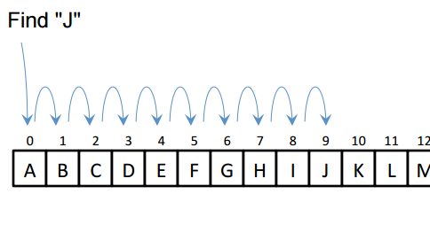

### 实现

#### 二分搜索

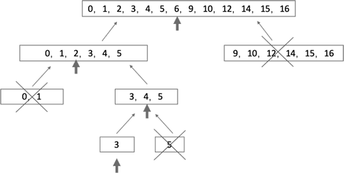

#### 二分搜索树

我们先来看二叉树查找时磁盘IO的次：定义一个树高为4的二叉树，查找值为10：

| IO次数 | 示意图                                                 | 说明 |
| ------ | ------------------------------------------------------ | ---- |
| 0      | 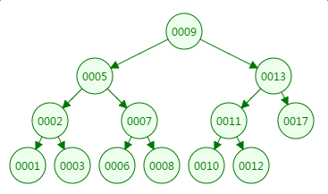 |      |
| 1      | 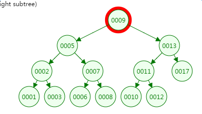 |      |
| 2      | 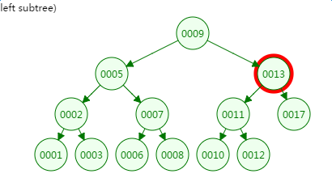 |      |
| 3      | 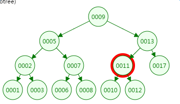 |      |
| 4      | 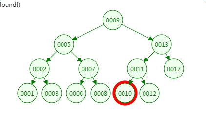  |      |

从二叉树的查找过程了来看，树的高度和磁盘IO的次数都是4，所以最坏的情况下磁盘IO的次数由树的高度来决定。

从前面分析情况来看，**减少磁盘IO的次数就必须要压缩树的高度**，让瘦高的树尽量变成矮胖的树，所以B-Tree就在这样伟大的时代背景下诞生了。

### 二分法的推广用法

#### 在海量数据或数据流中完成搜索

在海量（长度不可知）的单调序列中，可以以一定的步长跳跃式的搜索。

例如在递增的序列中寻找值X，约定步长为10000，N次跳跃后发现比X大的值，此时在索引(N-1)\*10000和N\*10000之间进行二分法搜索。

#### 三分法与二分法的区别

二分法适用于单调函数，而单峰函数用二分明显不太好了，对于有些单峰函数，可以求导后转化为单调函数，从而使用二分，然而很多情况求导是很麻烦的，这时就需要用到三分了。

**算法介绍**

1. 先将区间三分,每个区间的长度为1/3(right-left)

   ```java
   mid1=left+(right-left)/3;
   mid2=right-(right-left)/3;
   ```

2. 比较mid1和mid2谁更靠近极值，如果mid1更靠近极值，右区间改为mid2,否则左区间改为mid1(后面的代码都是   以求最大值为例）
   ```java
   if(calc(mid1)<calc(mid2))
   	left=mid1;
   else
   	right=mid2;
   ```

3. 重复1,2过程，直到不满足left+eps<right,也就是找到最值

**算法模板**

```java
double Calc(Type a){
    /* 根据题目的意思计算 */
}
void Solve(void){
    double Left, right;
    double mid, midmid;
    double mid_value, midmid_value;
    left = min; right = max;
    while (left + eps < Right)
    {
        mid = (left + right) / 2;
        midmid = (mid + right) / 2;
        mid_area = Calc(mid);
        midmid_area = Calc(midmid);
        if (mid_area >= midmid_area) right = midmid;
        else left = mid;
    }
}
```

#### 二分法与跳表

跳表的原理类似二分查找，但是数据结构用得链表，跳表在原有的有序链表上面增加了多级索引，通过索引来实现快速查找。理论有点抽象，下面也用个图来说明一下:

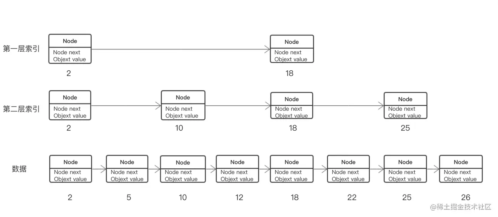

上图例子中是使用了一个单链表实现的简单的跳表， Node类里next指向下一个节点, value是当前的值，图上面数字是节点中的值，索引的Node是一个指针, 指向原始的节点。 上图的链表数值依次是 2,  5 , 10, 12, 18 , 22,  25,  26。假如在链表中要找是否有12,  需要从单链表头开始遍历，到第4个就找到18。当建立了如上图的2层索引后，首先从第一层索引开始， 2 -> 18 ， 18大于12不对，所以第二层索引 2 -> 10 找到10的位置，然后10 ->12 就找到了12。当数据量很大，查找的时间复杂度为O(logn)。图中索引是每隔一个节点建的索引(每隔1个相当于每次减半)，你也可以设计每隔3个节点建一个索引。索引层级也要根据数据量增加，单链表也可以改成双链表。

上面分析了跳表搜索的过程，接着聊聊数据插入过程，假如接下来要插入 6、7、 8、 9这几个元素，需要保持跳表节点顺序，可以利用索引找到第二层索引的中2 (第二层索引的10 大于 6, 7, 8 , 9)。插入元素后情况如下图所示：

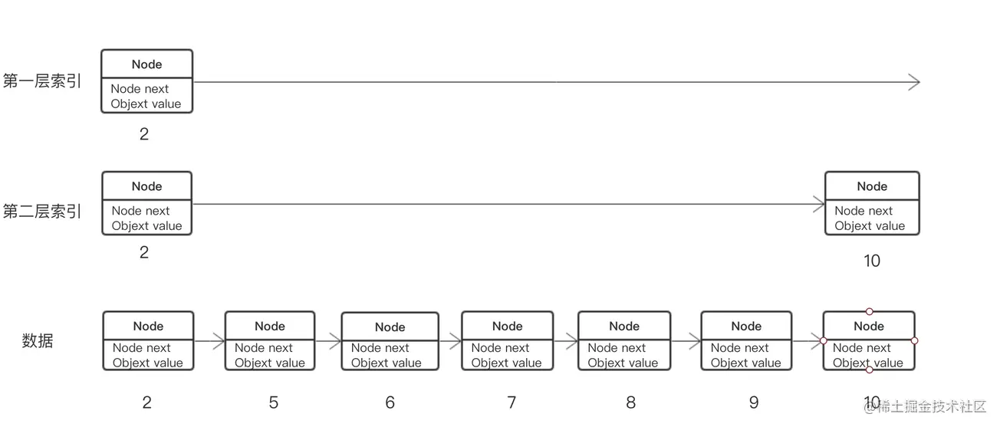

看上图所示，如果需要找9，你会发现查找速度下降，原因是由于插入数据导致原有索引性能退化啦，需要重新生成索引才能保证查找的速度。同样的，删除节点时通过索引快速找到需要删除的节点，删除后也同样需要维持新索引。创建索引会占据一定性能，在插入或者删除数据时，如果没插入或删除一个元素就重新创建索引又有点浪费，所以需要平衡一下，比如记录最底层的索引间的元素个数间隔，超过多少个再重新创建索引。

### 应用案例

#### RDBMS中B-Tree索引的实现

> m阶B-Tree满足以下条件：
>
> 1. 每个节点最多拥有m个子树
> 2. 根节点至少有2个子树
> 3. 分支节点至少拥有m/2颗子树（除根节点和叶子节点外都是分支节点）
> 4. 所有叶子节点都在同一层、每个节点最多可以有m-1个key，并且以升序排列

 如下有一个3阶的B树，查找元素21的过程：

| IO次数 | 示意图                                                 | 说明                                     |
| ------ | ------------------------------------------------------ | ---------------------------------------- |
| 0      | 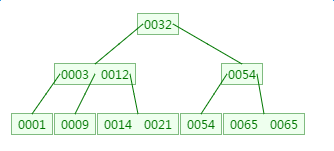 | 查找元素21                               |
| 1      | 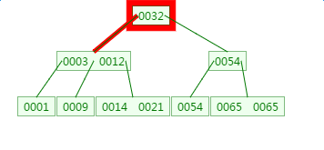 |                                          |
| 2      | 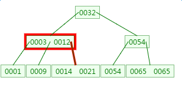  | 这里有一次内存比对：`21`分别跟3与12比对  |
| 3      | 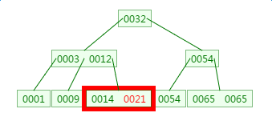   | 这里有一次内存比对，`21`分别跟14与21比对 |

从查找过程中发现，B树的比对次数和磁盘IO的次数与二叉树相差不了多少，所以这样看来并没有什么优势。

但是仔细一看会发现，**比对是在内存中完成中，不涉及到磁盘IO，耗时可以忽略不计。另外B树中一个节点中可以存放很多的key（个数由树阶决定）。**

**相同数量的key在B树中生成的节点要远远少于二叉树中的节点，相差的节点数量就等同于磁盘IO的次数。这样到达一定数量后，性能的差异就显现出来了。**

## 算法模板

### 搜索插入位置[leetcode 44]

https://leetcode-cn.com/problems/search-insert-position/

```java
/**
* 给定一个排序数组和一个目标值，在数组中找到目标值，并返回其索引。如果目标值不存在于数组中，返回它将会被按顺序插入的位置。
*/
class Solution {
    public int searchInsert(int[] nums, int target) {
      int n = nums.length;
      int left = 0, right = n - 1;
      while (left <= right) { // while灵活控制指针动作
        int mid = ((right - left) >> 1) + left; // 右移模拟2的整除运算
        if (target <= nums[mid]) {
          right = mid - 1; // ?
        } else {
          left = mid + 1; // ?
        }
      }
      return left;
    }
}
```

### 排列硬币[leetcode 441]

你总共有 n 枚硬币，并计划将它们按阶梯状排列。对于一个由 k 行组成的阶梯，其第 i 行必须正好有 i 枚硬币。阶梯的最后一行 可能 是不完整的。

https://leetcode-cn.com/problems/arranging-coins/solution/pai-lie-ying-bi-by-leetcode-solution-w52c/

```java
class Solution {
    public int arrangeCoins(int n) {
        int left = 1, right = n;
        // 总行数在1和硬币总块数之间
        while (left < right) {
            int mid = (right - left + 1) / 2 + left;
            // 注意等差数列的求和公式 Sn=n(a1+an)/2 
            if ((long) mid * (mid + 1) / 2 <= n) {
                left = mid;
            } else {
                right = mid - 1;
            }
        }
        return left;
    }
}
```

### X的平方根[leetcode 69]

```java
class Solution {
    public int mySqrt(int x) {
        int left = 0, right = x, res = 0;
        while (left <= right) {
            int mid = ((right - left) >> 1) + left;
            // mid 小，
            if ((long) mid * mid <= x) {
                res = mid;      // 相当于向下取整
                left = mid + 1; // mid本身排除在外
            } else {
                right = mid - 1; // mid 本身排除在外
            }
        }
        return res;
    }
}
```

### 猜数字大小[leetcode 374]

```java
public class Solution extends GuessGame {
    public int guessNumber(int n) {
        if (guess(n) == 0) return n;
        int flag = -1;
        int left = 1, right = n;
        int mid = 0;
        while (left <= right && flag != 0) {
            mid = left + (right - left) / 2;
            flag = guess(mid);
            if (flag == -1) right = mid;
            if (flag == 1) left = mid;
        }
        return mid;
    }
}
```

### 寻找峰值[leetcode 162 中等]

```java
/*
爬坡法
规律一：如果nums[i] > nums[i+1]，则在i之前一定存在峰值元素
规律二：如果nums[i] < nums[i+1]，则在i+1之后一定存在峰值元素
*/
func findPeakElement(nums []int) int {
   var left, right = 0, len(nums) - 1
   for left < right { // 为何不能取等？
      mid := (left + right) >> 1
      // 如果num[mid] > nums[mid+1] 左侧一定有峰值
      if nums[mid] > nums[mid+1] {
         right = mid
      } else {
         left = mid + 1 
      }
   }
   return left
}
```

## 参考资料

1. https://juejin.cn/post/6844903843990339597
2. https://www.cs.usfca.edu/~galles/visualization/BPlusTree.html
